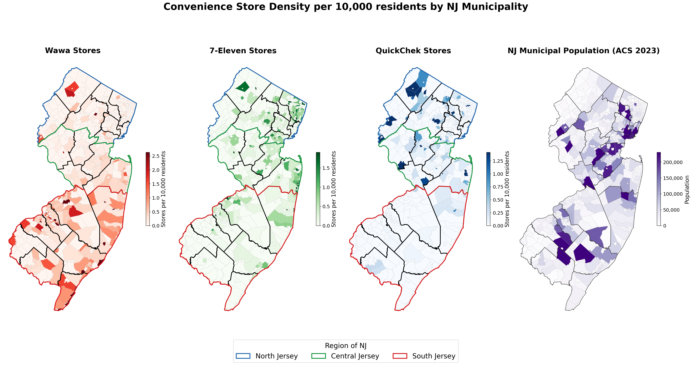
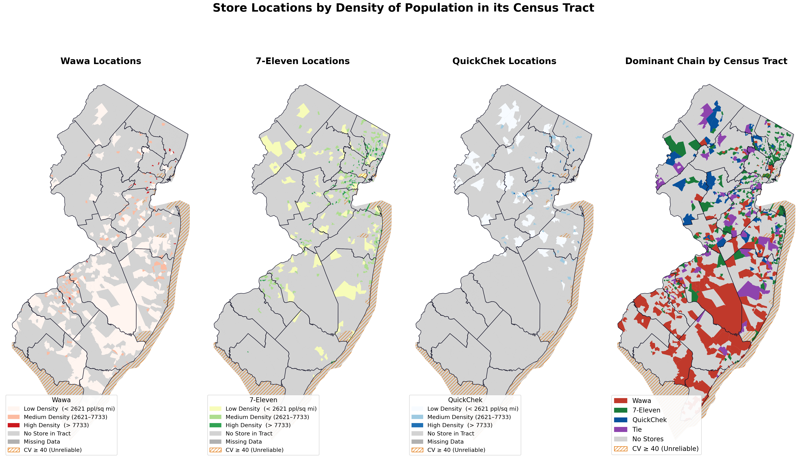
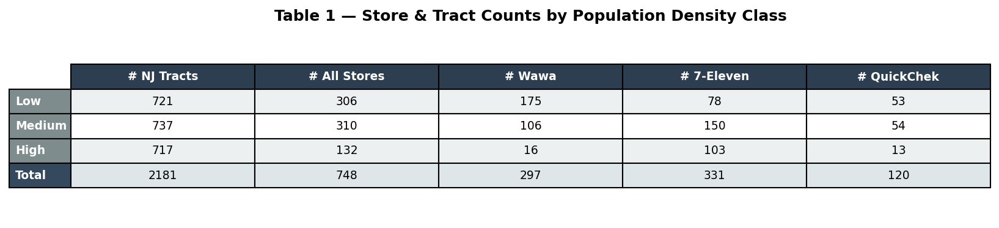

by: Joshua Darragh    

Uploaded 05/03/2026 for Command Line GIS - 595

<html lang="en">
<head>
  <meta charset="UTF-8">
  <title>My Final Project</title>
  
</head>
<body>
  <h1> Spatial Analysis of 3 Prominent Convenience Store Chains in NJ and How They Relate to Population Density</h1>
  
New Jersians are known for their fast-paced lives, sitting in too much traffic, and most of all, needing to get a cawfee first thing. Its for these reasons that the NJ convenience store is a vital component to Jersey living; when drudging through the everyday horrors of Route 1 congestion, NJTransit delays, and the impending doom that this state will be halfway underwater by the time your grandkids are born, you can always find oasis at a Wawa, QuickChek, or 7-11. 
    
  Jokes aside, these three convenience store chains are everywhere throughout the state with nearly 800 locations combined. Because of their prevalence, I thought it would be interesting to analyze the spatial patterns of each convenience store (both on their own and comparatively) to see what factors might influence a store's construction. For instance, growing up in South Jersey, there was always a Wawa within 15 minutes of me and I had never heard of QuickChek, but soon after moving to Central Jersey, I realized my experience is not held statewide. These stores' prominence vary widely across North, Central and South Jersey, and I am curious if their are trends that can be used to predict where a store might perform better in. Additionally, I think looking at the population density of the census tracts these stores reside in is benefitial to gain more understanding of what the average patreon looks like, and offer insight into what populations these stores cater to. 

  <h2>Maps Relating to Population Density</h2>

  <figure>
    
    <figcaption>Figure 1: Stores Counts per Capita (by 10,000 residents) 1.</figcaption>
  </figure>

  <figure>
    
    <figcaption>Figure 2: Store Locations by Census Tract, Catagorized by Population Density of the Census Tract.</figcaption>
  </figure>

    <figure>
    
    <figcaption>Figure 2.1: Table of Census Tracts that Contain Convenience Stores as Counts.</figcaption>
  </figure>

    <figure>
    
    <figcaption>Figure 2.2: Table of Census Tracts that Contain Convenience Stores as Percentages.</figcaption>
  </figure>
  
  <h2>Maps Relating to Spatial Distribution
  <figure>
    
    <figcaption>Figure 3: Gradient Map of How Far Away a Census Tract is to a Convenience Store.</figcaption>
  </figure>
    
  <h2>Interactive Map</h2>
  <iframe src="interactive_map.html" title="Interactive Map"></iframe>
